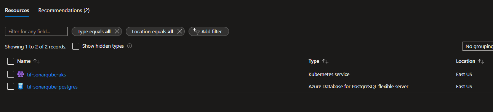
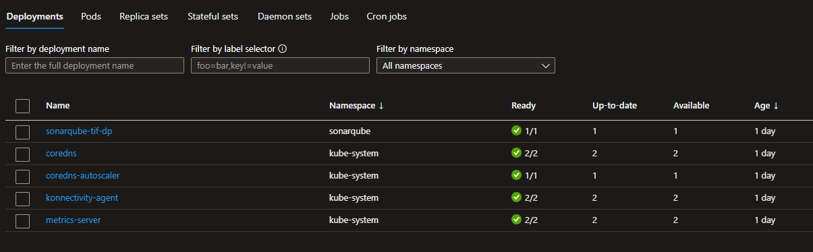
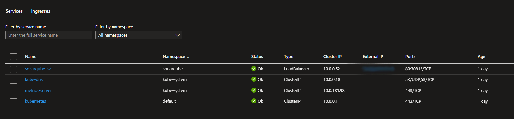
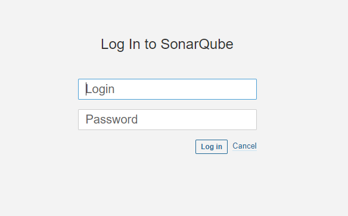
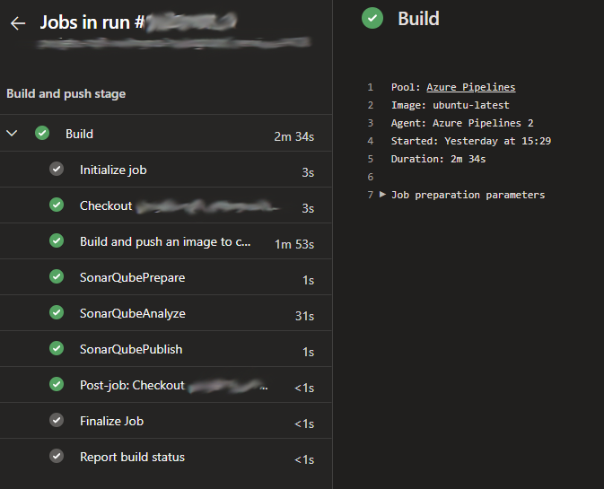
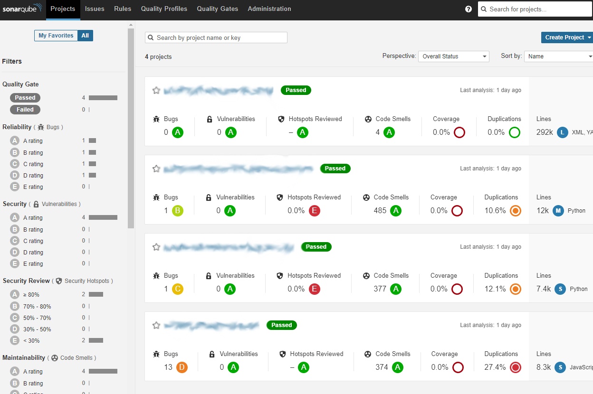

# project objective
deploy a sonarqube app and integrate in the CI pipeline.

# infrastructure provisioning 
i used terraform to create the aks cluster and the postgres database on azure cloud.  
ps: the variables.tf is not in the repository for security reasons.  
the code below is the aks creation:  
```terraform
resource "azurerm_kubernetes_cluster" "k8s" {
  name                = var.k8s_name
  location            = var.location
  resource_group_name = azurerm_resource_group.rg.name
  dns_prefix          = var.dns_prefix
  kubernetes_version  = var.kubernetes_version

  default_node_pool {
    name           = "agentpool"
    node_count     = var.agent_count
    vm_size        = "Standard_B2s"
  }

  tags = {
    Environment = "dev"
  }
}
```
azure portal after ```terraform apply```



# deploying the sonarqube application

the deployment is the ```manifests/sonar-dp.yaml```, i used a PersistentVolumeClaim (sonar-pvc.yaml) with 20gb of storage.  
the code below is where the deployment references the database using secrets (sonar-sec.yaml):
```
 envFrom:
  - secretRef:
     name: sonarqube-tif-sec
```
after ```kubectl apply -f sonar-dp.yaml```:  



then i created a loadbalancer service to expose the application:  



accessing the external-ip address we can see the application running:



# using sonarqube in the CI with azure pipelines

this is a section of the pipeline yaml file:

```yaml
stages:
- stage: Build
  displayName: Build and push stage
  jobs:
  - job: Build
    displayName: Build
    pool:
      vmImage: $(vmImageName)
    steps:
    - task: Docker@2
      displayName: Build and push an image to container registry
      inputs:
        command: buildAndPush
        buildContext: '$(Build.Repository.LocalPath)'
        repository: $(imageRepository)
        dockerfile: $(dockerfilePath)
        containerRegistry: $(dockerRegistryServiceConnection)
        tags: |
          1.0.$(semanticBuildNumber)
          latest
    - task: SonarQubePrepare@5
      inputs:
        SonarQube: 'Analyze "************"'
        scannerMode: 'CLI'
        configMode: 'manual'
        cliProjectKey: '**********************'
        cliSources: '.'
    - task: SonarQubeAnalyze@5
    - task: SonarQubePublish@5
      inputs:
        pollingTimeoutSec: '300'
 ```
after commiting in the project repository, the pipeline runs:




when the pipeline finishes, the code analysis is published in the application:



and our job is done!
